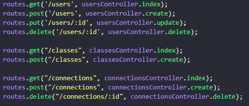

# Functionalities

## :twisted_rightwards_arrows: Connections

### -Route to list the total connections made;

### -Route to create a new connection;

## :notebook: Classes

### -Route to create a new class;

### -Route to list the Classes;

### -Route to filter classes by time, subject and week day;

# :computer: Technologies

 ### Typescript

 ### knex

 ### sqlite3

# :package: Run API

### Clone repository

```bash
$ git clone https://github.com/muNeves3/Proffy-server
$cd Proffy-server
```

### Install the dependencies

```bash
$npm install
```

### Run the application

```bash
$npm start
```

### Routes to test

<p>
    
</p>